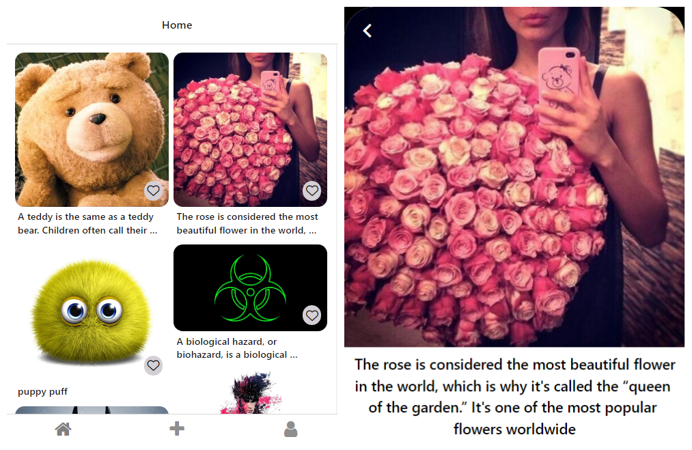
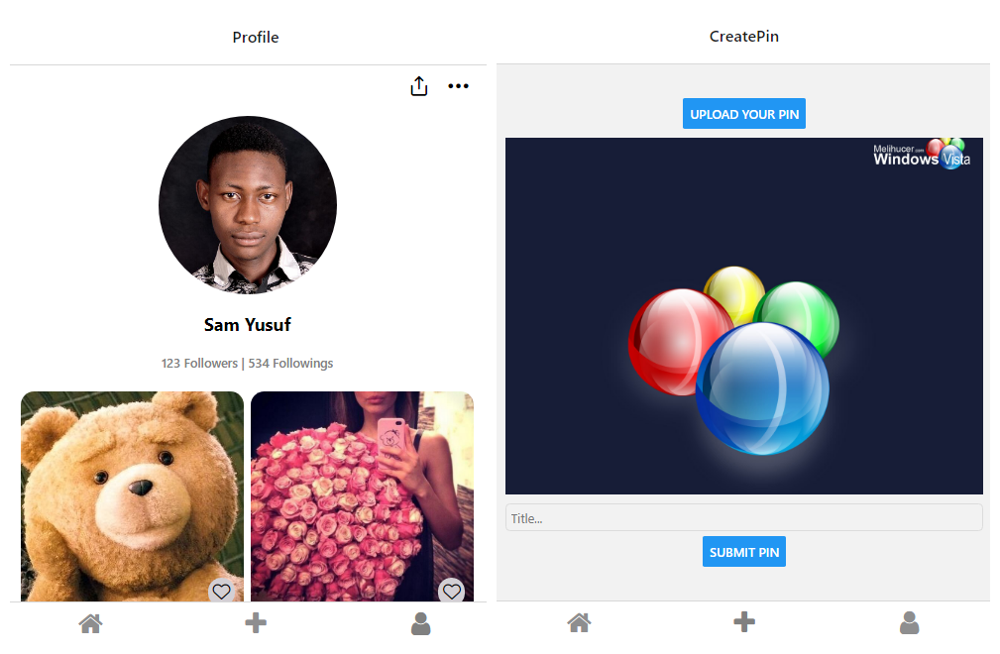

# Project Description

This mobile application is very similar to Pinterest.

# Installation

Please set up a React Native development environment if you have not already done so.
You will also need to install expo image picker, @expo/vector-icons and react native navigation.

expo-image-picker/
npm install @expo/vector-icons/
npm install @react-navigation/native/

# Running Android on a Mac or PC

Attach a device or run an emulator and run the following commands:

npm i\
npm react-native run-android

# Screenshots

# Ideas for Future Development
*Add a Splash Screen.\
*Add an app icon.

